# Jianmen — Lightweight, High-Performance Bastion Host

English | [简体中文](README.md)

Single binary · Zero external dependencies · Built-in SQLite · Apache-2.0 · v1.0.0

## Background

Bastion hosts centralize control over asset credentials, proxy all operational access, and keep a full audit trail. China's Classified Protection 2.0 (等保 2.0) requires audit data to be retained for at least six months. Commercial products charge per asset, while open-source alternatives come with many moving parts and heavy maintenance — and AI agents reaching internal networks still lack a closed loop for credential issuance and revocation.

## Features

- SSH/SFTP proxy, unified gateways for MySQL, PostgreSQL and Redis, browser-based RDP
- Session recording plus command, file and database auditing, with retention policies and data masking
- Fine-grained RBAC, embedded SQLite, single binary, runs on 0.5 vCPU / 1 GB RAM
- AI Bastion API: 30-minute temporary credentials, instant revocation, every query audited

## Screenshots

The screenshots below were taken in a local demo environment: hosts, databases and SSH targets are real containers running in WSL (MySQL 8.4 / PostgreSQL 16 / Redis 7 / OpenSSH); the business data is sample data.

| Login | Quick Connect (SSH / SFTP / Web RDP) |
| --- | --- |
| 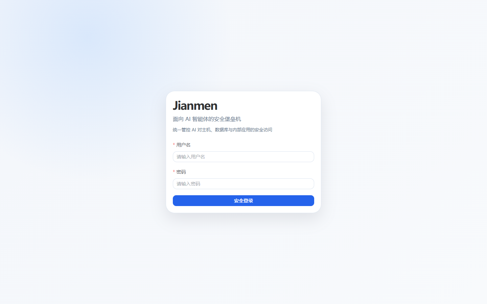 | 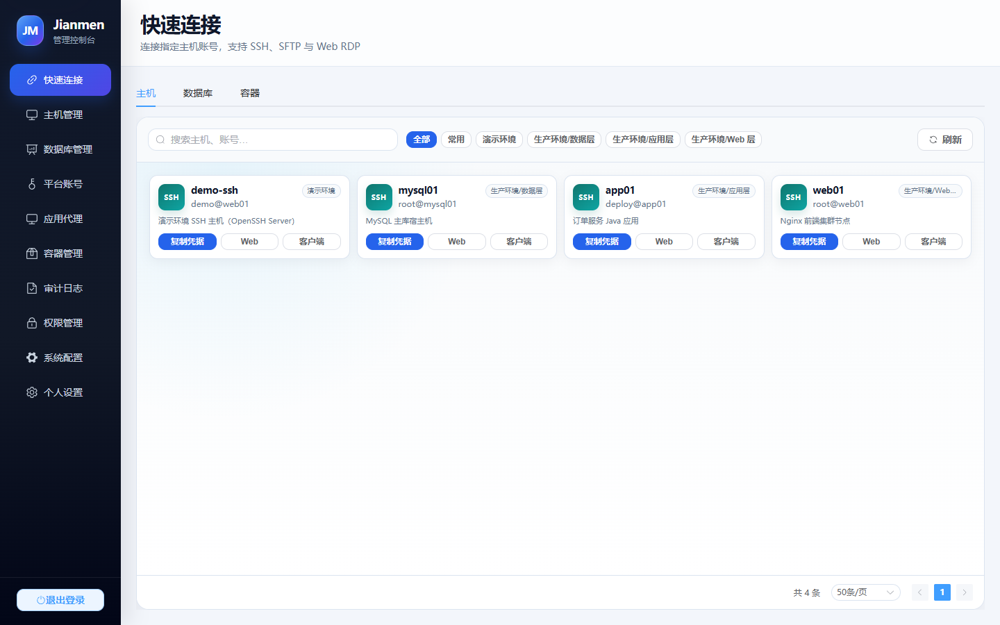 |
| **Hosts** | **Databases (MySQL / PostgreSQL / Redis)** |
| 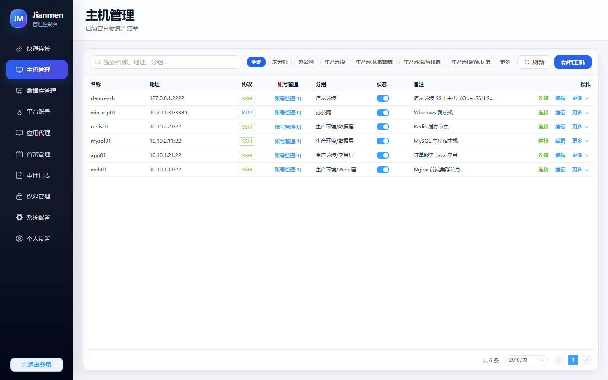 | 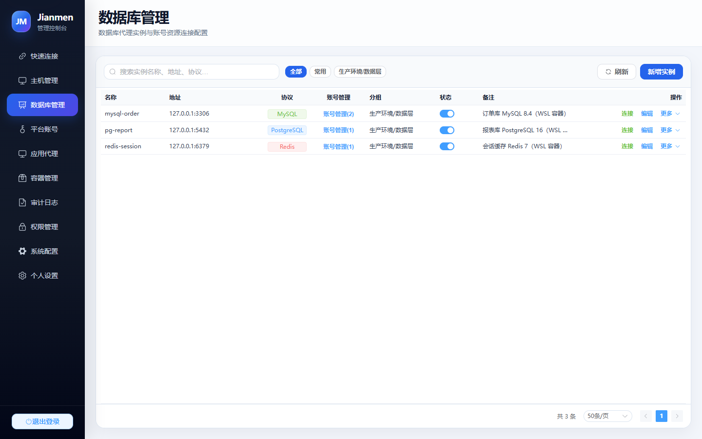 |
| **Web Terminal (real SSH session)** | **Online SQL (MySQL 8.4)** |
| 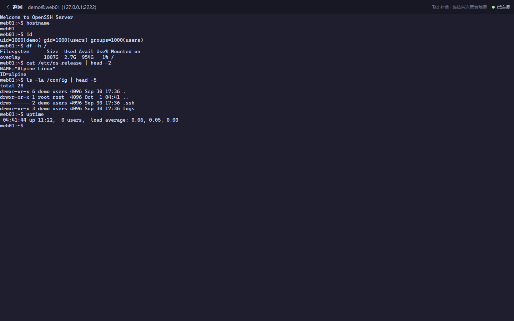 | 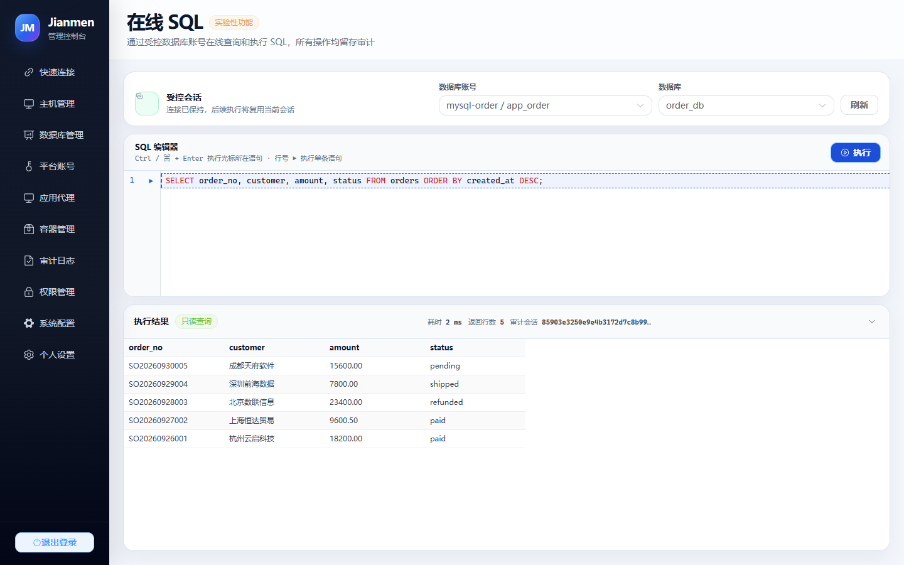 |
| **Online SQL (PostgreSQL 16)** | **Command Audit** |
| 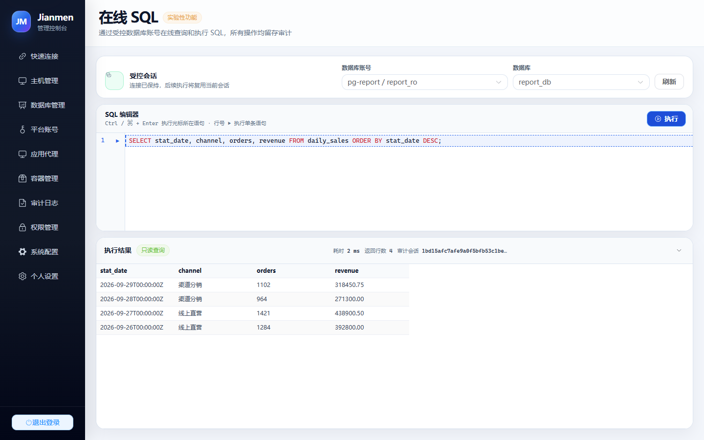 | 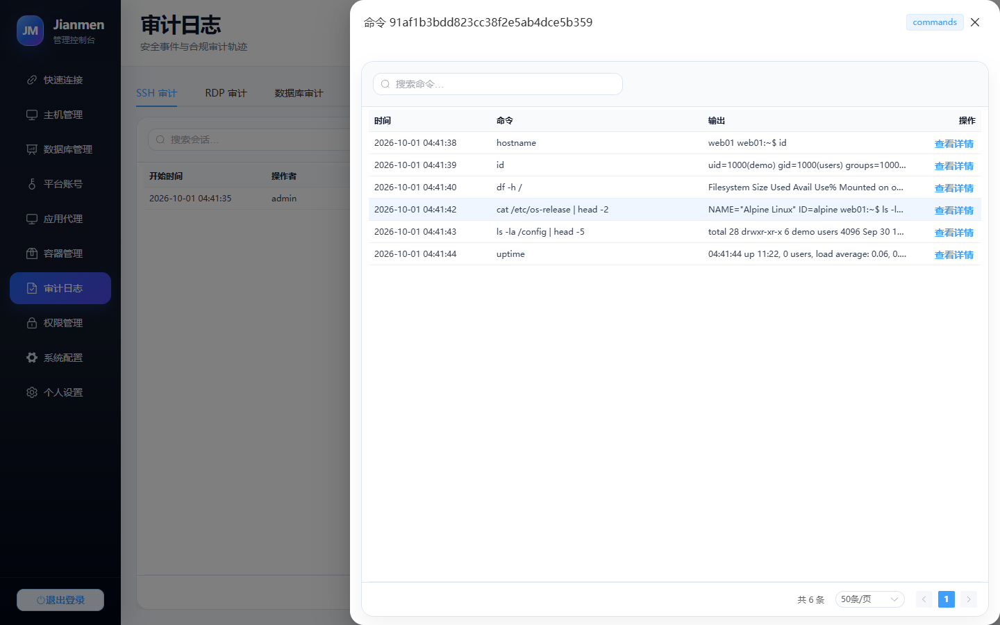 |
| **SSH Session Audit** | **Database Audit** |
| 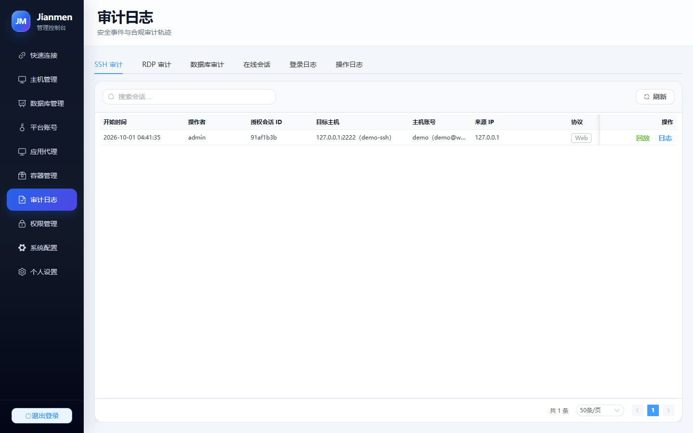 | 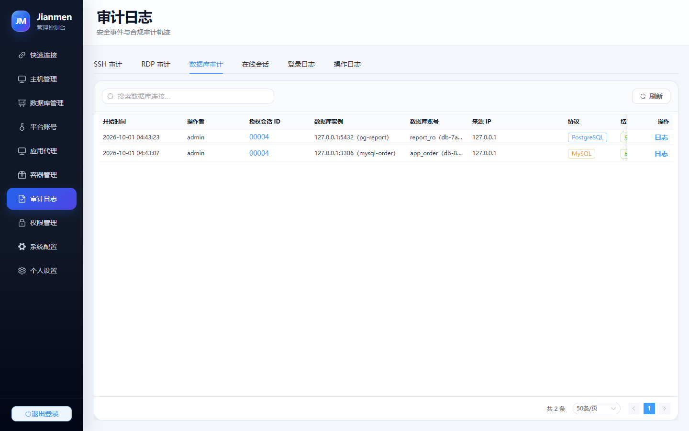 |
| **Online Sessions** | **Containers** |
| 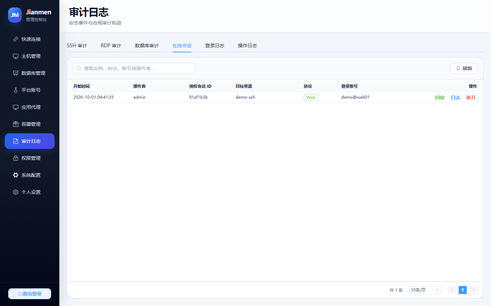 | 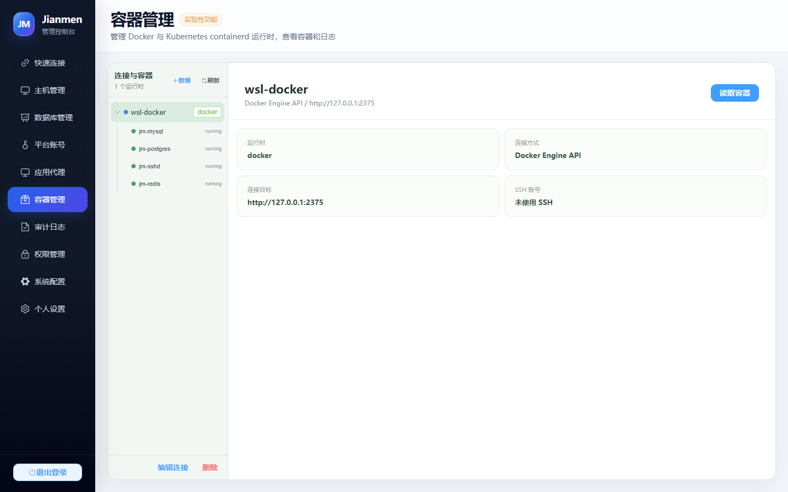 |
| **Unified RBAC** | **System Settings** |
| 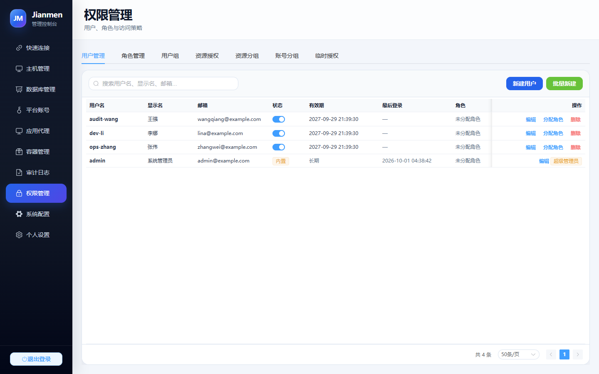 | 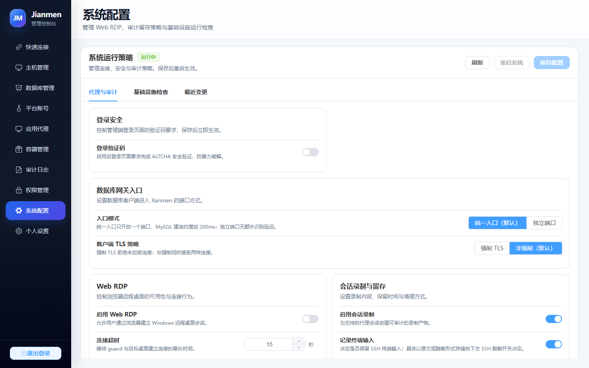 |

## Installation

### Docker

```shell
docker run -d --name jianmen --restart unless-stopped \
  -p 127.0.0.1:47100:47100 -p 47102:47102 -p 33060:33060 \
  -p 47110-47199:47110-47199 -v jianmen-data:/app/data \
  ghcr.io/zhang-guo-wen/jianmen:latest
```

Open <http://127.0.0.1:47100> to create the first administrator. For browser-based RDP, use the `vX.Y.Z-rdp` tag instead.

### Linux package

```bash
tar -xzf jianmen-vX.Y.Z-linux-amd64-lite.tar.gz
cd jianmen-vX.Y.Z-linux-amd64-lite
cp config.example.json config.json
./jianmen -config config.json
```

For the RDP build, use `config.rdp.example.json` instead. Never expose port 47100 to the public internet; audit retention defaults to 30 days and should be raised to 180+ days for compliance.

[Apache License 2.0](LICENSE)
