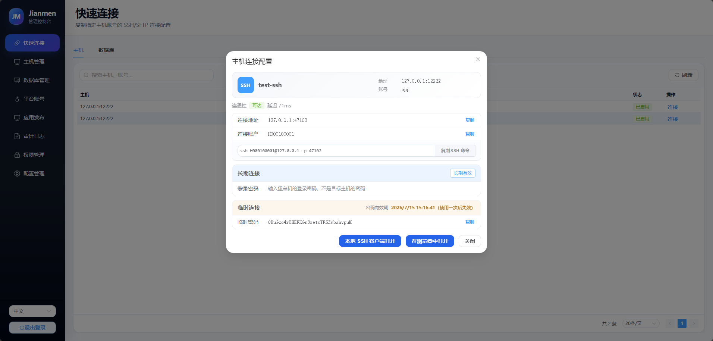
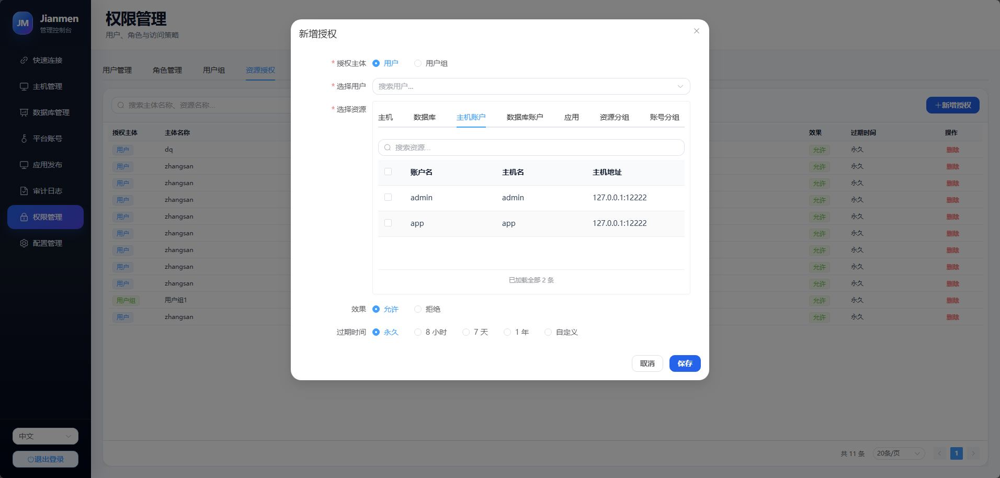

# Jianmen — 轻量级堡垒机

**Jianmen**（剑门）是一个 Go 语言编写的轻量级堡垒机（Bastion Host），提供 SSH/SFTP 代理、数据库代理、终端录像、命令审计和 Web 管理界面。

> 当前处于 内测阶段，尚未发布正式版本。

## 功能特性

### 资源与账号管理

- **主机资源管理** — 统一维护Linux window主机及其登录账号，支持分组、状态、有效期、密码与私钥认证。
- **数据库资源管理** — 管理 MySQL、PostgreSQL、Redis 实例及数据库账号，资源变更可动态刷新代理配置。
- **应用与平台账号** — 支持内网应用代理，使内网应用走堡垒机鉴权后，能通过代理被外网访问。

### 安全连接

- **SSH Shell 代理** — 支持密码、公钥和 keyboard-interactive 认证，以及 PTY、窗口 Resize、Signal 转发。
- **SFTP 文件代理** — 提供语义层文件代理，兼容 Xftp、WinSCP、FileZilla 等主流客户端。
- **多协议数据库代理** — 支持 MySQL、PostgreSQL、Redis 连接代理，统一执行身份识别、资源授权和会话控制。
- **本地 SSH 客户端** — 可配置并调用系统默认客户端、Xshell、PuTTY 等本地程序快速发起连接。
- **云端 SSH 客户端** — 可通过web快速发起ssh连接，支持tab提示词。
- **Web RDP** — 通过 Apache Guacamole 在浏览器访问 Windows，凭据留在服务端，连接、剪贴板、上传、下载和磁盘映射分别授权。

### 数据库协议与兼容版本

以下版本均已使用官方 Docker 镜像和真实客户端通过 Jianmen 数据库网关完成自动化验证：

| 协议 | 已验证版本 | 协议与认证 | 已验证能力 |
|---|---|---|---|
| MySQL | `5.7`、`8.0`、`8.4` | Protocol 4.1、SSLRequest/TLS；网关及 5.7 上游使用 `mysql_native_password`，8.x 上游支持 `caching_sha2_password` | 初始数据库、普通查询、预处理语句、事务、大报文和审计脱敏 |
| PostgreSQL | `14`、`15`、`16`、`17`、`18` | Protocol 3.0、TLS/Direct TLS、上游 SCRAM-SHA-256；3.2 客户端可协商降级到 3.0 | 简单/扩展查询、预处理语句、事务、COPY、CancelRequest、大报文和错误恢复 |
| Redis | `6.2`、`7.4`、`8.8` | RESP2/RESP3、双参数 `AUTH`、`HELLO 2 AUTH` / `HELLO 3 AUTH`，支持配置 TLS | 流水线、MULTI/EXEC、SELECT、Pub/Sub、RESP3 Push、大报文和审计脱敏 |

### 审计与追溯

- **终端录像** — 使用 asciinema v2 兼容格式记录 SSH 会话并支持在线回放。
- **命令审计** — 解析交互式 Shell 命令，保留执行时间、会话和识别置信度。
- **文件审计** — 记录 SFTP 文件操作，并按文件句柄统计上传、下载和读写字节。
- **数据库审计** — 记录数据库连接和可观察的查询事件，支持按会话检索。
- **RDP 图形录像** — guacd 生成 `.guac` 录像，上传对象存储；审计页可按用户、主机账号、时间和结果筛选并回放。
- **审计治理** — 支持保留期、回放字节配额、分批一致性清理和敏感字段脱敏。

### 其他

- **细粒度 RBAC** — 支持用户、用户组、角色、权限和资源授权，覆盖主机、数据库、账号、应用及资源分组。
- **跨平台构建** — 提供 Windows 与 Linux 构建脚本，可生成包含前端资源的独立二进制程序，提供docker部署。
- **开发计划** - 后续开发计划见仓库项目的看板

### Docker 部署

```shell
docker run -d \
  --name jianmen \
  --restart unless-stopped \
  -p 127.0.0.1:47100:47100 \
  -p 33060:33060 \
  -p 47110-47199:47110-47199 \
  -v jianmen-data:/app/data \
  ghcr.io/zhang-guo-wen/jianmen:latest
```

| 端口 | 用途 |
|---|---|
| `47100` | Web 管理页面和管理 API |
| `33060` | 统一数据库入口（默认，MySQL/PostgreSQL/Redis） |
| `47110-47199` | 内网应用动态代理端口范围 |

浏览器访问，初始化管理员账号密码：

```text
http://127.0.0.1:47100
```

默认部署不需要证书。生产环境请将 Jianmen 与 Nginx、Caddy 等反向代理置于受控网络，
由反向代理提供 HTTPS，不要把管理端口 `47100` 直接暴露到公网。

## 截图
快速连接

主机和数据库管理

web终端功能

审计回放功能

ssh和xftp审计日志

数据库审计功能

内网应用代理功能


权限管理



## 许可证

[MIT](LICENSE)

## 贡献

欢迎贡献，或者其他合作可以加我微信 v353107440
