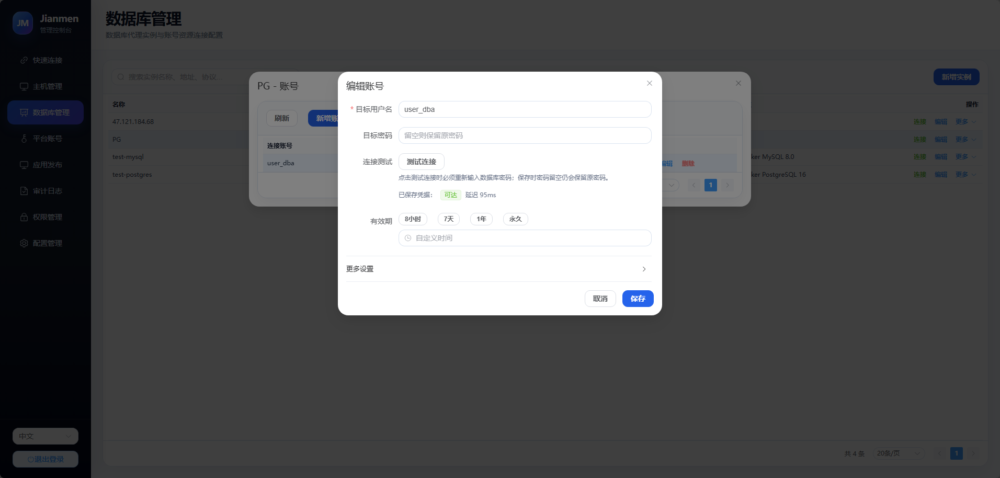
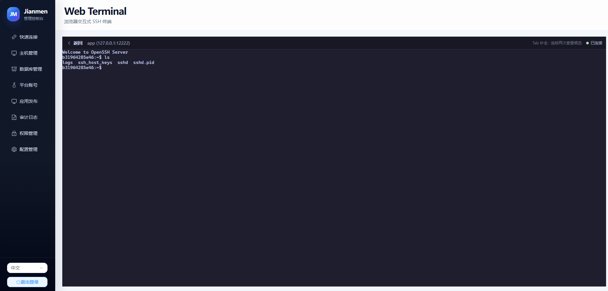
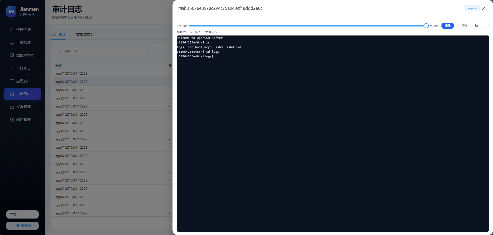
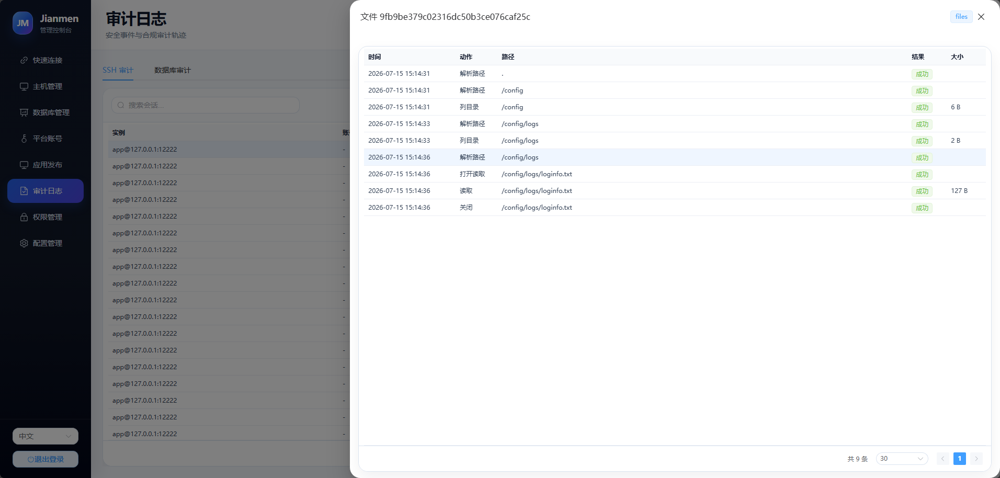
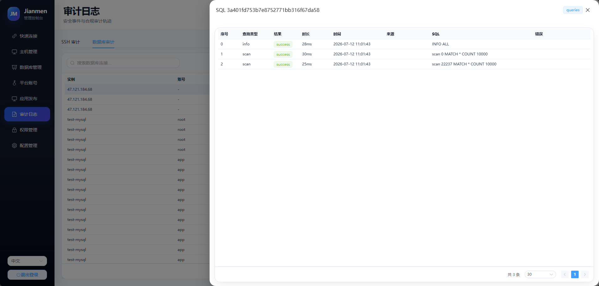
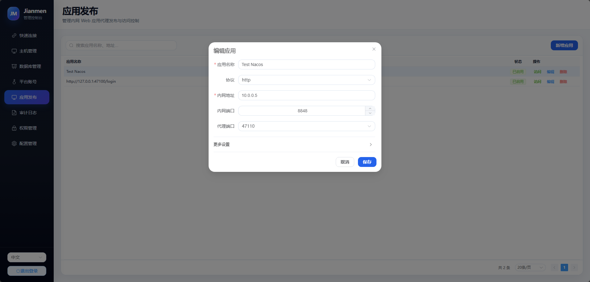
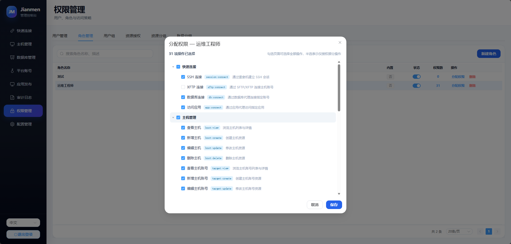

# Jianmen — 轻量级堡垒机

**Jianmen**（剑门）是一个 Go 语言编写的轻量级堡垒机（Bastion Host），提供 SSH/SFTP 代理、数据库代理、终端录像、命令审计和 Web 管理界面。

> 当前处于 内测阶段，尚未发布正式版本。

## 功能特性

### 资源与账号管理

- **主机资源管理** — 统一维护主机及其登录账号，支持分组、状态、有效期、密码与私钥认证。
- **数据库资源管理** — 管理 MySQL、PostgreSQL、Redis 实例及数据库账号，资源变更可动态刷新代理配置。
- **应用与平台账号** — 支持内网应用代理，使内网应用走堡垒机鉴权后，能通过代理被外网访问。

### 安全连接

- **SSH Shell 代理** — 支持密码、公钥和 keyboard-interactive 认证，以及 PTY、窗口 Resize、Signal 转发。
- **SFTP 文件代理** — 提供语义层文件代理，兼容 Xftp、WinSCP、FileZilla 等主流客户端。
- **多协议数据库代理** — 支持 MySQL、PostgreSQL、Redis 连接代理，统一执行身份识别、资源授权和会话控制。
- **本地 SSH 客户端** — 可配置并调用系统默认客户端、Xshell、PuTTY 等本地程序快速发起连接。
- **云端 SSH 客户端** — 可通过web快速发起ssh连接，支持tab提示词。
- **Web RDP** — 通过 Apache Guacamole 在浏览器访问 Windows，凭据留在服务端，连接、剪贴板、上传、下载和磁盘映射分别授权。

### 数据库协议与兼容版本

以下版本均已使用官方 Docker 镜像和真实客户端通过 Jianmen 数据库网关完成自动化验证：

| 协议 | 已验证版本 | 协议与认证 | 已验证能力 |
|---|---|---|---|
| MySQL | `5.7`、`8.0`、`8.4` | Protocol 4.1、SSLRequest/TLS；网关及 5.7 上游使用 `mysql_native_password`，8.x 上游支持 `caching_sha2_password` | 初始数据库、普通查询、预处理语句、事务、大报文和审计脱敏 |
| PostgreSQL | `14`、`15`、`16`、`17`、`18` | Protocol 3.0、TLS/Direct TLS、上游 SCRAM-SHA-256；3.2 客户端可协商降级到 3.0 | 简单/扩展查询、预处理语句、事务、COPY、CancelRequest、大报文和错误恢复 |
| Redis | `6.2`、`7.4`、`8.8` | RESP2/RESP3、双参数 `AUTH`、`HELLO 2 AUTH` / `HELLO 3 AUTH`，支持配置 TLS | 流水线、MULTI/EXEC、SELECT、Pub/Sub、RESP3 Push、大报文和审计脱敏 |

数据库入口支持两种全局模式：

- `unified`（默认）：MySQL、PostgreSQL、Redis 原生客户端共用 `33060`。MySQL 必须等待协议探测窗口，因此每次新建连接约增加 200ms；已建立连接的查询和传输不受这段等待影响。
- `independent`：MySQL 使用 `33061`、PostgreSQL 使用 `33062`、Redis 使用 `33063`，不引入统一入口的探测等待。

两种模式不会同时监听；在“系统设置”切换并重启服务后生效。快速连接会读取当前生效配置并自动生成正确端口。
完整启用三种协议需要数据库网关 TLS 身份。仅回环地址、未填写证书路径的本机配置会在数据目录自动生成并持久化本地 TLS 身份，使 PostgreSQL 可直接使用；非回环监听仍必须显式配置受信任的证书与私钥。

以上是默认回归兼容范围；未列出的版本或扩展可能可以使用，但不作兼容承诺。认证路径、TLS 边界、明确不支持项和测试方法见 [数据库真实协议兼容矩阵](docs/database-protocol-compatibility.md)。

### 审计与追溯

- **终端录像** — 使用 asciinema v2 兼容格式记录 SSH 会话并支持在线回放。
- **命令审计** — 解析交互式 Shell 命令，保留执行时间、会话和识别置信度。
- **文件审计** — 记录 SFTP 文件操作，并按文件句柄统计上传、下载和读写字节。
- **数据库审计** — 记录数据库连接和可观察的查询事件，支持按会话检索。
- **RDP 图形录像** — guacd 生成 `.guac` 录像，上传对象存储；审计页可按用户、主机账号、时间和结果筛选并回放。
- **审计治理** — 支持保留期、回放字节配额、分批一致性清理和敏感字段脱敏。

### 其他

- **细粒度 RBAC** — 支持用户、用户组、角色、权限和资源授权，覆盖主机、数据库、账号、应用及资源分组。
- **跨平台构建** — 提供 Windows 与 Linux 构建脚本，可生成包含前端资源的独立二进制程序，提供docker部署。
- **开发计划** - 后续开发计划见仓库项目的看板

## 部署

Web RDP 的默认容器部署把 Jianmen Go 程序和固定版本的 `guacd` 放在同一镜像、
同一容器中。Go 进程强制以前台模式启动并停止 `guacd`，后者只监听容器回环地址
`127.0.0.1:4822`，不需要独立 sidecar、共享卷或内部网络端口。需要复用已有
`guacd` 集群时，仍可关闭托管模式并配置外部私有地址。完整权限边界、对象存储
配置和 Compose 示例见 [Web RDP 部署与安全边界](docs/web-rdp.md)。

### 审计保留与回放配额

审计清理在服务启动时执行一次，之后每小时执行；单次处理数量受批次限制。清理流程会先在数据库记录清理意图，再删除 SSH/数据库回放目录或 RDP 对象存储录像，最后在一个事务内删除会话、录像索引及关联事件。外部录像删除失败时不会删除数据库记录；录像已不存在则按已删除处理。

```json
"recording": {
  "enabled": true,
  "record_input": false,
  "record_commands": true,
  "retention_days": 30,
  "max_replay_bytes": 10737418240,
  "cleanup_batch_size": 100
}
```

- `record_input` 默认关闭，避免保存终端原始输入。
- `retention_days` 范围为 1–3650 天。
- `max_replay_bytes` 为回放根目录字节上限，设为 `0` 时不启用配额清理。
- `cleanup_batch_size` 范围为 1–1000；配额超限时按会话结束时间从旧到新清理。

### Docker 部署

默认 Docker 流程由 Windows 交叉编译 Linux amd64 程序，再由 WSL Docker
装配单镜像。必须先在仓库根目录的 Windows PowerShell 中执行：

```powershell
.\build.ps1
```

该脚本会构建前端，并生成包含前端资源的
`dist/bastion-core-linux-amd64`。Dockerfile 不会重复下载 Go/npm 依赖，
而是把这个产物装配到固定的
`guacamole/guacd:1.6.0@sha256:8974eaa9ba32f713daf311e7cc8cd7e4cdfba1edea39eed75524e78ef4b08f4f`
运行层中。

默认容器配置要求管理端使用 TLS；缺少 `/app/certs/admin.crt` 或
`/app/certs/admin.key` 时会安全退出，不会自动降级为明文 HTTP。首次本机评估可先在
WSL Docker 数据卷中生成一套临时自签名证书。`jianmen-certs` 是 Compose 的
外部卷，因此必须在启动前准备：

```bash
docker volume create jianmen-certs
docker run --rm --user 0 \
  -v jianmen-certs:/certs \
  alpine:3.23 sh -c \
  'apk add --no-cache openssl &&
   openssl req -x509 -newkey rsa:3072 -nodes -days 30 \
     -keyout /certs/admin.key -out /certs/admin.crt \
     -subj "/CN=localhost" \
     -addext "subjectAltName=DNS:localhost,IP:127.0.0.1" &&
   openssl req -x509 -newkey rsa:3072 -nodes -days 30 \
     -keyout /tmp/database-ca.key -out /certs/database-ca.crt \
     -subj "/CN=Jianmen local database CA" \
     -addext "basicConstraints=critical,CA:TRUE" \
     -addext "keyUsage=critical,keyCertSign,cRLSign" &&
   openssl req -new -newkey rsa:3072 -nodes \
     -keyout /certs/database.key -out /tmp/database.csr \
     -subj "/CN=localhost" &&
   printf "%s\n" \
     "basicConstraints=critical,CA:FALSE" \
     "keyUsage=critical,digitalSignature,keyEncipherment" \
     "extendedKeyUsage=serverAuth" \
     "subjectAltName=DNS:localhost,IP:127.0.0.1" >/tmp/database.ext &&
   openssl x509 -req -in /tmp/database.csr \
     -CA /certs/database-ca.crt -CAkey /tmp/database-ca.key -CAcreateserial \
     -out /certs/database.crt -days 30 -sha256 -extfile /tmp/database.ext &&
   rm -f /certs/database-ca.srl /tmp/database-ca.key /tmp/database.csr /tmp/database.ext &&
   chown 10001:10001 /certs/admin.key /certs/admin.crt /certs/database.key /certs/database.crt /certs/database-ca.crt &&
   chmod 600 /certs/admin.key /certs/database.key &&
   chmod 644 /certs/admin.crt /certs/database.crt /certs/database-ca.crt'
```

完成交叉编译和证书准备后，在 WSL 的仓库根目录启动 Compose：

```bash
docker compose -f docker-compose.web-rdp.yml up -d --build
```

Compose 运行时只有一个 `jianmen` 服务容器；一次性的 `volume-init` 只负责初始化
数据卷权限，完成后退出。Jianmen 和 `guacd` 在 `jianmen` 容器中以 UID/GID
`10001` 运行，共享 `/app/data/rdp-spool` 和 `/app/data/rdp-drive`。管理端仍只
映射到宿主机回环地址，`guacd` 的 4822 端口不发布到宿主机。

默认端口：

| 端口 | 用途 |
|---|---|
| `47100` | Web 管理页面和管理 API |
| `47102` | SSH/SFTP 堡垒机入口 |
| `33060` | 统一数据库入口（默认，MySQL/PostgreSQL/Redis） |
| `33061` | 独立模式 MySQL 入口 |
| `33062` | 独立模式 PostgreSQL 入口（客户端连接必须使用 TLS） |
| `33063` | 独立模式 Redis 入口（远程客户端 AUTH 必须使用 TLS） |
| `47110-47199` | 内网应用动态代理端口范围 |

默认统一模式只需发布 `33060`。若在系统设置中切换为独立端口模式，重启容器时还需增加 `-p 33061:33061 -p 33062:33062 -p 33063:33063`；Compose 部署同样需要在 `ports` 中增加这三个映射。

### Jianmen 到实际数据库的上游 TLS

数据库实例的上游 TLS 控制的是 `Jianmen → 实际数据库` 这一段链路，与客户端连接数据库网关时使用的 `客户端 → Jianmen` TLS 相互独立。新建实例默认选择 `disable`，以便连接仅提供 IP、未启用 TLS 或没有可用 CA 的数据库；已有实例会保留原来的 TLS 模式，不会因默认值变化被批量降级。

| 模式 | 行为 | 适用场景 |
|---|---|---|
| `disable`（默认） | 不加密，不校验证书 | 数据库未启用 TLS，且 Jianmen 与数据库之间是受信任内网 |
| `verify-ca` | 加密并验证证书链，不校验主机名 | 数据库证书没有匹配连接地址的 SAN |
| `verify-full` | 加密并验证证书链与主机名 | 数据库证书和名称配置完整，安全性最高 |

使用 `disable` 时，查询结果和认证数据都可能在上游网络中以明文传输，Redis 的 `AUTH` 凭据也不例外。跨公网、跨租户网络或其他不可信网络时，应配置数据库 TLS 并选择 `verify-ca` 或 `verify-full`。MySQL `caching_sha2_password` 完整认证和 PostgreSQL 明文密码认证仍要求经过验证的 TLS；遇到这些认证方式时，连接测试和实际代理连接都会拒绝不安全降级，需要启用 TLS 或调整数据库认证方式。

### 数据库网关 TLS 身份校验

统一入口以及各协议独立入口应配置服务端证书、私钥、公共 CA 文件与客户端验证名称。`server_name` 必须是证书 SAN 中的 DNS 名称或 IP；客户端连接命令使用该名称，而不是监听地址。`ca_file` 仅保存可公开分发的 CA PEM。只有单张、当前有效且可验证的自签名叶证书才允许省略 `ca_file`，此时按证书固定（pin）语义分发；普通 CA 签发的叶证书不能被当作根证书。`key_file` 永不会通过 API 返回。

```json
"mode": "unified",
"unified": {
  "enabled": true,
  "listen_addr": "0.0.0.0:33060",
  "cert_file": "/app/certs/database.crt",
  "key_file": "/app/certs/database.key",
  "ca_file": "/app/certs/database-ca.crt",
  "server_name": "localhost",
  "detection_timeout_ms": 200
}
```

快速连接会提供 CA 下载、CA 内容和证书 SHA-256 指纹，并且只生成强校验命令：PostgreSQL 使用 `sslmode=verify-full sslrootcert=...`，MySQL 使用 `--ssl-mode=VERIFY_IDENTITY --ssl-ca=...`。TLS 身份材料不完整时不会降级为 `require` 或 `REQUIRED` 命令。

上面的本机评估流程生成的数据库叶证书 SAN 包含 `localhost` 和 `127.0.0.1`，与默认配置的 `server_name: "localhost"` 一致。生产环境使用其他网关域名时，必须同时替换 `server_name`，并重新签发包含该 DNS 名称 SAN 的数据库叶证书。

### 使用 Nginx 代理数据库网关

Nginx 可以通过 Stream 模块代理统一数据库入口，但必须使用四层 TCP 透传。数据库原生 TLS 由 Jianmen 终结，Nginx 不解密流量：

```text
原生数据库客户端 == 数据库协议 TLS ==> Nginx -- TCP 透传 --> Jianmen
Jianmen == 上游 TLS 或受信内网明文 ==> 实际数据库
```

下面是统一入口 `33060` 的完整最小 `nginx.conf`。已有 Nginx 配置时只需合并其中的 `stream {}`，不要重复定义 `events {}`；`stream {}` 必须放在顶层，不能放进 `http {}`：

```nginx
worker_processes auto;

events {
    worker_connections 4096;
}

stream {
    log_format jianmen_database
        '$remote_addr:$remote_port [$time_local] '
        '$protocol $status $session_time '
        '$bytes_sent $bytes_received '
        '$upstream_addr $upstream_connect_time';

    access_log /var/log/nginx/jianmen-database-access.log jianmen_database;

    upstream jianmen_database_gateway {
        server jianmen:33060;
    }

    server {
        listen 33060 so_keepalive=on;

        proxy_connect_timeout 5s;
        proxy_timeout 1h;
        proxy_socket_keepalive on;
        proxy_protocol off;

        proxy_pass jianmen_database_gateway;
    }
}
```

示例中的 `jianmen:33060` 适用于 Nginx 和 Jianmen 位于同一个 Docker/Compose 网络且 Jianmen 服务名为 `jianmen` 的情况。同机裸机部署应改为 `127.0.0.1:33060`，分机部署则改为 Jianmen 的受控内网地址。

部署时必须注意：

- 不要添加 `listen 33060 ssl`、`ssl_certificate`、`proxy_ssl on` 或 `ssl_preread on`。MySQL 由服务端先发送 Greeting，PostgreSQL 通常先发送明文 `SSLRequest`，Nginx 的通用 TLS 监听无法在同一个端口终结三种原生协议；Redis 虽然可以直接发送 TLS ClientHello，也不能解决 MySQL 和 PostgreSQL。Web 管理端是标准 HTTPS，可以单独由 Nginx 正常终结 TLS。
- 数据库网关证书、私钥和 CA 仍配置在 Jianmen。证书 SAN 必须包含客户端实际连接的域名或 IP。Nginx 不会终结或改变 `客户端 → Jianmen` 的原生 TLS，也不能把 `Jianmen → 实际数据库` 的 `disable` 链路变成加密链路。
- Jianmen 当前不解析 PROXY Protocol，必须保持 `proxy_protocol off`。开启后，Nginx 会在数据库协议前插入 `PROXY ...`，导致统一入口和独立入口握手失败。Jianmen 看到的 TCP 对端会是 Nginx，真实客户端地址应从 Nginx Stream 访问日志查询。
- 不要依赖“回环地址允许本机明文开发”作为代理部署的安全边界。Nginx 转发到 `127.0.0.1` 时，外部连接在 Jianmen 看来同样来自回环地址；只要数据库入口会被外部访问，就必须给 Jianmen 配置网关证书。
- Docker 部署时只让 Nginx 发布宿主机 `33060`，Jianmen 的 `33060` 只保留在隔离容器网络，不要再使用 `-p 33060:33060` 直接发布 Jianmen。若两者共享主机网络，不能同时监听 `0.0.0.0:33060`；可以让 Jianmen 监听 `127.0.0.1:33060`，让 Nginx 仅监听服务器的具体对外 IP。
- `proxy_timeout` 是连接连续两次读写之间允许的最大空闲时间。默认值可能误断开长期空闲的数据库连接池，示例使用 1 小时，应按业务连接池寿命调整。每条数据库会话大约占用一个客户端连接和一个上游连接；`worker_connections` 是每个 worker 的上限，应结合 worker 数量按预期并发量的两倍预留，同时检查 `worker_rlimit_nofile` 和系统文件描述符限制。
- 不要使用 HTTP 请求或通用 TLS ClientHello 检查统一数据库端口。容器存活检查继续使用 `/api/init/status`；端口就绪检查可以建立 TCP 连接后立即关闭。端到端检查应使用 MySQL、PostgreSQL 或 Redis 原生客户端和专用监控账号。
- 独立端口模式使用相同的纯 TCP 配置，分别映射 `33061 → 33061`、`33062 → 33062`、`33063 → 33063`。修改配置后先执行 `nginx -t`，验证成功再重载。

使用前应确认安装的 Nginx 包包含 Stream 模块。更多指令语义参见 [NGINX Stream TCP 代理](https://nginx.org/en/docs/stream/ngx_stream_proxy_module.html)、[Stream 核心模块](https://nginx.org/en/docs/stream/ngx_stream_core_module.html) 和 [Stream upstream 模块](https://nginx.org/en/docs/stream/ngx_stream_upstream_module.html)。

浏览器访问：

```text
https://127.0.0.1:47100
```

自签名证书只适合本机评估，浏览器会提示该证书不受信任；生产环境应挂载由受信任 CA
签发的证书。应用代理在用户未登录时会自动跳转到 Jianmen 登录页。默认会使用当前访问的
主机名和 `admin.listen_addr` 的端口生成登录地址。

如在隔离 Docker 网络内由 Caddy 等反向代理终止 TLS，可使用仓库提供的
`config.docker.proxy.example.json`。下面的完整示例不会把容器内的明文 `47100` 发布到
宿主机；它只代理 Web 管理端，示例中的 `33060` 仍由 Jianmen 直接发布，不代表 Caddy
同时代理数据库入口。使用前请把示例域名替换为真实域名并完成 DNS 解析：

```bash
mkdir -p /opt/jianmen
cp config.docker.proxy.example.json /opt/jianmen/config.json
sed -i 's/jianmen\.example\.com/your.real.domain/g' /opt/jianmen/config.json
printf '%s\n' \
  'your.real.domain {' \
  '  reverse_proxy jianmen:47100' \
  '}' > /opt/jianmen/Caddyfile

docker network create jianmen-internal
docker run -d \
  --name jianmen \
  --restart unless-stopped \
  --network jianmen-internal \
  -p 47102:47102 \
  -p 33060:33060 \
  -p 47110-47199:47110-47199 \
  -v jianmen-data:/app/data \
  -v jianmen-certs:/app/certs:ro \
  -v /opt/jianmen/config.json:/app/config.json:ro \
  ghcr.io/zhang-guo-wen/jianmen:latest
docker run -d \
  --name jianmen-caddy \
  --restart unless-stopped \
  --network jianmen-internal \
  -p 80:80 -p 443:443 \
  -v /opt/jianmen/Caddyfile:/etc/caddy/Caddyfile:ro \
  -v jianmen-caddy-data:/data \
  caddy:2-alpine
```

`admin.public_url` 只允许 HTTP/HTTPS 的站点根地址，不能包含路径、查询参数或片段。为了让登录 Cookie 在管理端口和应用代理端口之间共享，建议使用相同主机名。

Admin 管理端默认仅允许回环地址使用 HTTP，适合本机开发。非回环监听必须配置证书和私钥，或显式设置 `admin.tls.allow_insecure_http: true`；后者只适用于受控的开发环境，不应作为生产部署方案。启用内置 TLS 的配置示例：

```json
"admin": {
  "listen_addr": "0.0.0.0:47100",
  "public_url": "https://jianmen.example.com",
  "tls": {
    "cert_file": "/app/certs/admin.crt",
    "key_file": "/app/certs/admin.key",
    "allow_insecure_http": false
  }
}
```

镜像内置的 `config.docker.json` 默认要求证书，且不会启用
`allow_insecure_http`。只有类似上述代理示例、容器明文端口不离开受控内部网络时，才可在
挂载的自定义配置中显式打开该开关；不得把这种配置下的 `47100` 发布到公网。

新增或编辑应用时，只需填写完整应用地址，例如 `http://47.121.184.68:18848/nacos/#/login`。系统会自动解析协议、主机、端口和默认访问路径，并在应用列表中生成可复制、可直接打开的代理访问地址。

容器默认使用仓库中的 `config.docker.json`。如需自定义数据库、监听地址或端口，可以挂载自己的配置文件：

```bash
docker run -d \
  --name jianmen \
  --restart unless-stopped \
  -p 127.0.0.1:47100:47100 \
  -p 47102:47102 \
  -p 33060:33060 \
  -p 47110-47199:47110-47199 \
  -v jianmen-data:/app/data \
  -v jianmen-certs:/app/certs:ro \
  -v /opt/jianmen/config.json:/app/config.json:ro \
  ghcr.io/zhang-guo-wen/jianmen:latest
```

升级容器时不要删除 `jianmen-data` 数据卷：

```bash
docker pull ghcr.io/zhang-guo-wen/jianmen:latest
docker rm -f jianmen
# 使用上面的 docker run 命令重新创建容器
```

建议定期备份数据卷，尤其是 `/app/data/encryption.key` 和 `/app/data/bastion.db`。加密密钥丢失后，数据库中保存的主机、数据库和平台账号凭据将无法解密。

### GitHub Release 包部署

在仓库的 GitHub Releases 页面下载与服务器架构匹配的压缩包：

| 系统 | amd64 | arm64 |
|---|---|---|
| Windows | `jianmen-vX.Y.Z-windows-amd64.zip` | `jianmen-vX.Y.Z-windows-arm64.zip` |
| Linux | `jianmen-vX.Y.Z-linux-amd64.tar.gz` | `jianmen-vX.Y.Z-linux-arm64.tar.gz` |

同时需要在服务器防火墙或云安全组中放行实际使用的端口。

## 截图
快速连接

主机和数据库管理

web终端功能

审计回放功能

ssh和xftp审计日志

数据库审计功能

内网应用代理功能


权限管理



## 许可证

[MIT](LICENSE)

## 贡献

欢迎贡献，或者其他合作可以加我微信 v353107440
