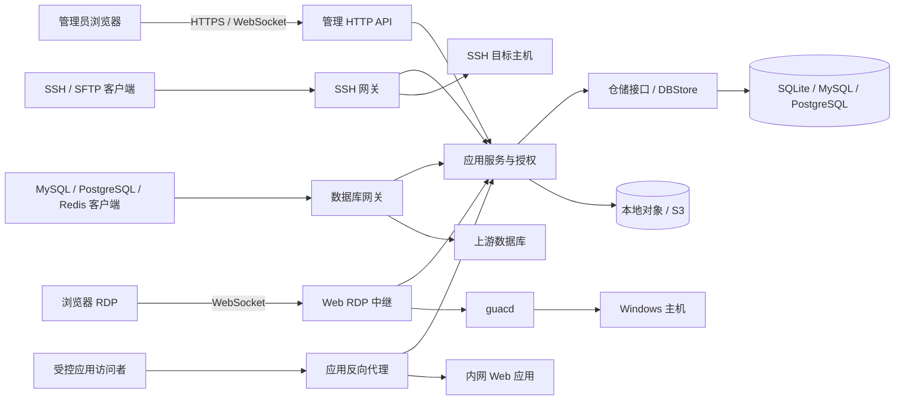
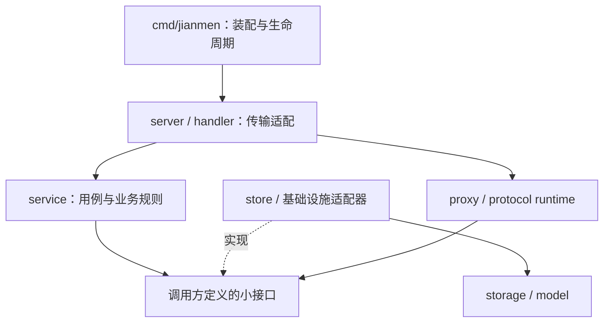

# Jianmen 全局架构与工程规范

> 文档版本：1.0
> 代码基线：`dev` 分支，2026-07-23
> 适用范围：后端、Web 前端、协议代理、数据存储、测试、构建与部署

本文既描述仓库的当前实现，也定义后续代码必须遵守的增量演进规则。标记为“目标”的内容是新代码约束，不表示现有代码已经全部完成迁移。

## 1. 架构结论

Jianmen 采用 **Go 模块化单体 + 多协议代理运行时 + 嵌入式 Vue 管理台**：

- 一个 Go 进程统一承载管理 API、SSH/SFTP、数据库网关、应用代理、Web Terminal、Web RDP 编排和后台治理任务。
- 业务按 Go package 和接口边界拆分，不按网络拆成微服务；当前规模下，这能降低部署、密钥管理、会话一致性和审计关联的复杂度。
- Vue 静态产物通过 `go:embed` 打进可执行文件，部署时不需要独立的前端服务。
- 元数据默认使用 SQLite，也支持 MySQL、PostgreSQL；回放对象可存本地文件系统或 S3 兼容对象存储。
- SSH、数据库、RDP 等访问路径默认遵循“鉴权失败关闭、授权失败关闭、要求审计时审计失败关闭”的安全原则。

核心质量目标按优先级排序：

1. 安全与审计完整性。
2. 协议兼容性和会话正确性。
3. 数据迁移与升级可恢复性。
4. 单二进制、双架构、低运维成本。
5. 管理台的一致性、可访问性和可维护性。

## 2. 系统上下文



### 2.1 进程启动顺序

`cmd/jianmen` 是唯一 composition root，启动顺序必须保持可预测：

1. 解析运行参数，严格加载 JSON 配置，应用默认值并校验。
2. 初始化凭据加密主密钥。
3. 打开元数据库；SQLite 在迁移前生成 `.bak` 备份。
4. 执行版本化、事务化数据库迁移和初始数据 bootstrap。
5. 创建 `DBStore`，再构造 Identity、Authorization、Browser Session、审计、资源管理等服务。
6. 恢复过期审计租约，启动审计保留和数据库账号 Saga 对账任务。
7. 并发启动 SSH、数据库、管理 HTTP、应用代理和可选 guacd 运行时。
8. 监听 `SIGINT` / `SIGTERM`，通过共享 `context.Context` 协调关闭。

禁止在任意业务 package 的 `init()` 中连接数据库、启动 goroutine 或读取环境；所有有副作用的依赖都由 composition root 显式创建。

## 3. 技术选型

| 领域 | 当前选型 | 采用原因与约束 |
|---|---|---|
| 后端语言 | Go 1.23 | 单二进制、并发网络服务成熟、交叉编译直接；版本以 `go.mod` 为准 |
| 管理 API | `net/http`、`http.ServeMux` | 依赖少，路由和中间件行为可审计；不额外引入 Gin/Echo |
| 日志 | `log/slog` | 结构化字段、标准库、适合关联 `request_id`、会话和资源 |
| ORM / 数据库 | GORM 1.31；SQLite、MySQL、PostgreSQL | SQLite 支持轻量部署，外部数据库支持规模化元数据存储 |
| SSH / SFTP | `golang.org/x/crypto/ssh`、`github.com/pkg/sftp` | Go 原生代理与认证控制，便于审计 Channel 和文件事件 |
| 数据库协议 | 自有 MySQL/PostgreSQL/Redis 网关与解析器 | 在认证、RBAC、审计、限流和协议兼容之间保持统一控制 |
| WebSocket | Gorilla WebSocket | Web Terminal、Web RDP 中继所需的稳定双向通道 |
| Web RDP | Apache Guacamole / guacd 1.6.0 | 浏览器 RDP、剪贴板、文件与录制能力；运行时版本和镜像摘要固定 |
| 对象存储 | 本地文件系统、MinIO S3 SDK | 单机默认本地，生产可切换 S3 兼容存储 |
| 前端 | Vue 3.5、Composition API、TypeScript 5.6 | 类型化组件边界和响应式组合逻辑 |
| UI / 状态 / 路由 | Element Plus 2.8、Pinia 3、Vue Router 4 | 管理台组件、少量全局状态、路由级懒加载 |
| 前端构建 | Vite 8、Node 24（CI） | 快速开发与生产分包；依赖必须由 `package-lock.json` 锁定 |
| 终端 / RDP 客户端 | xterm.js 6、`guacamole-common-js` | 浏览器终端和远程桌面协议适配 |
| 前端测试 | Vitest、Vue Test Utils、happy-dom；`node:test` + `tsx` | 组件/Composable 测试与无 DOM 纯逻辑测试分层 |
| 后端测试 | `testing`、`httptest`、race、fuzz、Docker 实库 | 不引入额外断言框架，协议边界采用真实服务验证 |
| CI / 发布 | GitHub Actions、Buildx、QEMU、GHCR | PR 质量门、双架构镜像和语义化版本发布 |

### 3.1 不选微服务的原因

SSH、数据库和 RDP 会话共享身份、资源授权、在线会话、审计租约与录制策略。拆成微服务会立即引入分布式事务、跨服务密钥、审计事件一致性和更多部署单元。只有在出现独立扩缩容需求、明确的团队边界，并且接口已稳定后，才评估把协议网关拆成独立进程。

## 4. 后端组件与职责

| 组件 | 主要目录 | 职责 |
|---|---|---|
| Composition root | `cmd/jianmen/` | 配置、依赖装配、生命周期、后台任务和进程退出 |
| 配置 | `internal/config/` | 配置 DTO、默认值、严格解码、TLS/端口/范围校验 |
| 持久化实体 | `internal/model/` | GORM 实体、索引、关联、ID 与加密字段钩子 |
| 数据基础设施 | `internal/storage/` | 驱动、连接池、迁移、序列、bootstrap、SQLite 备份 |
| 仓储实现 | `internal/store/` | `DBStore` 的领域数据读写、事务和持久化映射 |
| 应用服务 | `internal/service/` | 用例编排、业务校验、RBAC、资源生命周期、Saga、审计策略 |
| HTTP handler | `internal/handler/` | 请求 DTO、严格解码、调用 service、错误到 HTTP 的映射 |
| 运行时 server | `internal/server/` | HTTP 路由/中间件、监听器、协议握手与网络生命周期 |
| 协议代理 | `internal/proxy/` | SSH/SFTP/RDP/MySQL wire 等底层协议转发与解析 |
| 录像与审计流 | `internal/recording/` | asciinema、命令/文件事件、流式脱敏、回放文件安全 |
| 授权 | `internal/rbac/` | Action 目录、角色权限和资源授权决策 |
| 基础设施适配 | `internal/objectstore/`、`dbtls/`、`sshhost/`、`guacd*` | 对象存储、证书、主机身份和 guacd 运行时 |
| 在线状态 | `internal/online/` | 进程内在线会话注册、查询和中断 |
| 前端嵌入 | `internal/frontend/` | 嵌入静态资源和 SPA fallback |

### 4.1 当前结构与目标结构

当前处于渐进式分层阶段：

- `systemsettings`、`sqlconsole`、`webrdp` 已有独立 `internal/handler/<feature>`。
- 大部分管理 API 仍位于 `internal/server/admin/*_handlers.go`。
- `internal/store` 仍包含部分面向 HTTP 展示的 View 映射。

新功能按目标结构落地；旧代码只在实际修改对应功能时逐步迁移，禁止为了目录整齐进行一次性全仓搬家。

## 5. 代码分层与依赖规则



### 5.1 允许与禁止的依赖

| 层 | 可以依赖 | 禁止依赖 |
|---|---|---|
| `cmd/jianmen` | 所有内部实现，用于装配 | 承载可复用业务规则 |
| `handler` / HTTP transport | `service`、请求/响应 DTO、`apiresp` | 直接写 GORM、直接读取全局配置、实现业务事务 |
| `service` | `model`、`rbac`、由本包定义的 repository/adapter 接口 | `net/http`、Vue DTO、具体 `DBStore`、全局单例 |
| `store` | `storage`、`model`、GORM | HTTP 状态码、浏览器行为、网络监听器 |
| `server` / `proxy` | 协议库、service 接口、recording | 把通用业务规则藏在连接循环里 |
| `model` | 标准库和必要的持久化钩子 | service、handler、server |

接口由使用方定义，并保持最小化。例如 service 只声明当前用例需要的 repository 方法，`DBStore` 隐式实现；不要建立包含几十个方法的全局 Repository 接口。

### 5.2 标准请求链

管理写请求的标准链路如下：

1. request ID 中间件注入 `request_id`。
2. Cookie Session 认证，非安全方法校验 `X-CSRF-Token`。
3. handler 限制请求体大小、拒绝未知字段并转换为输入 DTO。
4. service 校验业务规则、执行授权并调用 repository 接口。
5. store 在 `WithContext` 和必要的事务中持久化。
6. handler 使用统一成功/错误 Envelope 返回，日志记录 `request_id`、actor 和资源，不记录秘密。

协议连接采用相同原则，但认证、授权、审计会话和上游连接由协议 server 适配，不能绕过 service 授权边界。

### 5.3 事务与并发规则

- 同一业务不变量涉及多表写入时，事务边界放在 store 或专门的事务端口中。
- 涉及外部数据库开户等“数据库事务 + 外部副作用”的流程使用可恢复 Saga、幂等键和后台对账，不能假装为本地事务。
- 所有数据库调用传播调用方 `context.Context`；取消后不得继续写入。
- goroutine 必须有明确所有者、退出条件和错误汇聚通道。
- 会话结束、租约和审计收尾使用有界超时；不得无限等待外部系统。

## 6. 文件目录规划

### 6.1 后端当前与增量规划

```text
cmd/jianmen/                 # 仅进程入口、装配、运行时开关
internal/
  config/                    # 配置模型和校验
  model/                     # 数据库实体
  storage/                   # DB 驱动、迁移、bootstrap
  store/                     # repository 实现；按领域拆 dbstore_<feature>.go
  service/                   # 每个业务能力一个 <feature>.go + _test.go
  handler/<feature>/         # 新管理 API 的 HTTP adapter
  server/
    admin/                   # 路由、中间件、尚未迁移的旧 handler
    sshserver/               # SSH 监听与连接生命周期
    dbproxy/                 # 数据库网关协议运行时
    appproxy/                # 应用反向代理
  proxy/                     # 可独立测试的协议细节
  recording/                 # 审计与回放
  objectstore/               # 对象存储适配
  frontend/                  # 构建产物嵌入
  integration/               # build tag 隔离的真实依赖测试
```

放置判断：

- “这条 HTTP 请求如何解析？”放 `handler`。
- “当前用户能否执行业务动作？”放 `service` / `rbac`。
- “如何在数据库原子保存？”放 `store` / `storage`。
- “协议帧如何解析或转发？”放 `server/<protocol>` 或 `proxy/<protocol>`。
- “进程启动时构造哪些对象？”放 `cmd/jianmen`。

### 6.2 前端当前结构

```text
web/src/
  main.ts, App.vue            # 应用启动和全局壳
  router/, navigation.ts      # 路由、菜单、权限 key
  views/                      # 路由页面与业务编排
  components/                 # 共享 UI 和已有功能子组件
  composables/                # 有状态、可复用、含副作用的逻辑
  stores/                     # 真正跨页面的 Pinia 状态
  api/                        # HTTP 封装、端点和 API 类型
  config/                     # 本地客户端能力配置
  utils/                      # 无 Vue 状态的纯函数
  i18n/                       # 类型安全中文词典
  styles/                     # 全局 Token、壳和主题
```

当前 `api/client.ts` 和多个 `views/*.vue` 已较大。新复杂功能采用渐进式 feature 目录，不要求先搬迁旧代码：

```text
web/src/
  app/                        # 后续承接 main、App、router、navigation
  shared/
    api/                      # fetch transport、Envelope、通用类型
    ui/                       # DataTableCard、FormDialog 等通用组件
    lib/                      # 纯函数
    styles/                   # Token 与主题
  features/<feature>/
    api.ts                    # 该功能端点
    types.ts
    components/
    composables/
    utils/
    *.test.ts
  views/                      # 只解析路由参数并组合 feature 容器
```

依赖方向固定为 `app/views -> features -> shared`，feature 之间不互相深层导入；共享状态不足以跨功能时，不要创建 Pinia Store。

### 6.3 命名规则

- Go 文件按能力命名：`host_management.go`、`host_management_test.go`；迁移文件包含稳定版本号或能力名。
- Vue 组件使用 PascalCase，Composable 使用 `useXxx.ts`，纯函数使用 camelCase 文件名。
- 测试与源码同目录：Go 为 `_test.go`，前端纯逻辑为 `.test.ts`，挂载测试为 `.mount.test.ts`。
- 新 Vue SFC 使用 `<script setup lang="ts">`、`<template>`、`<style scoped>` 顺序；props 和 emits 必须类型化。

## 7. 数据与 API 契约

### 7.1 数据模型

元数据包括用户与浏览器会话、主机/数据库/应用/平台账号、RBAC 与资源授权、临时访问、审计会话与事件、系统设置修订等。新增字段时：

1. 先定义向前兼容的模型变化。
2. 在 `internal/storage` 增加有序、幂等、事务化迁移。
3. 为旧结构升级、重复运行和失败重试编写迁移测试。
4. 更新配置或 API 类型，最后更新 UI。

业务表统一使用 `active_marker INT NULL DEFAULT 1` 作为逻辑删除字段：`1` 表示未删除，`NULL` 表示已逻辑删除，只允许这两种值。业务启停由 `status` 表达，手动停用不得改写 `active_marker`。查询、删除、唯一索引、迁移和三数据库类型映射的完整规则见[审计字段、逻辑删除与统一时间规范](2026-07-23-auditable-fields-design.md)。

业务和审计时间统一按 UTC 语义存入无时区列，数据库保留微秒；API 序列化和页面显示统一使用 `yyyy-MM-dd HH:mm:ss`，例如 `2006-05-05 11:02:05`。API 输出已经转换到系统业务时区，前端不得再按浏览器时区二次转换。

生产迁移视为前向迁移。回滚旧二进制前必须确认旧版本能读取新 schema；不能把“回退镜像”当成完整数据库回滚方案。

### 7.2 HTTP 响应

成功响应：

```json
{
  "code": 0,
  "data": {},
  "message": "ok",
  "request_id": "...",
  "timestamp": "2026-07-23 00:00:00"
}
```

错误响应：

```json
{
  "code": 400,
  "error": {
    "code": "VALIDATION_ERROR",
    "message": "...",
    "details": {}
  },
  "request_id": "...",
  "timestamp": "2026-07-23 00:00:00"
}
```

新增端点必须使用 `internal/pkg/apiresp`，错误码保持稳定，`message` 面向人，`details` 只放安全、结构化的诊断信息。前端统一转为 `ApiError`，不得让页面分别猜测后端错误结构。

请求、响应及 Envelope 中表示时间点的字段统一序列化为 `yyyy-MM-dd HH:mm:ss`；对应 Go layout 为 `2006-01-02 15:04:05`。不输出 `T`、`Z`、时区偏移或小数秒，也不得直接序列化 `time.Time`。外部协议强制要求的 RFC3339、Unix 时间戳等机器格式只存在于对应适配边界，进入管理 API 前必须完成转换。

### 7.3 安全基线

- 浏览器会话 Cookie 为 `HttpOnly`、`SameSite=Lax`，HTTPS 环境使用 `Secure`。
- 非 GET/HEAD/OPTIONS 请求必须验证 CSRF。
- 密码使用 bcrypt；连接凭据使用 AES-256-GCM 加密字段；Token/Session secret 尽量只存摘要。
- 日志、URL、命令行参数和审计详情不得包含密码、私钥、访问令牌或完整连接串。
- SSH 主机身份、数据库 TLS 身份和证书链验证不得静默降级。
- 代理入口必须在建立上游连接和创建审计会话前完成认证与授权。
- 回放路径必须限制在配置根目录中并拒绝符号链接逃逸。

## 8. 前端架构与视觉规范

### 8.1 组件责任图

| 层 | 单一职责 |
|---|---|
| `App.vue` | 应用壳、侧栏、页头、路由出口和全局权限提示 |
| `views/*View.vue` | 路由参数、页面级加载和 feature 组合，不承载多个独立功能实现 |
| feature 容器 | 一项业务能力的状态编排 |
| feature 子组件 | 表单、筛选、列表、详情等单一 UI 区块；props down、events up |
| composable | 可复用的响应式状态、异步副作用和生命周期 |
| Pinia Store | 跨路由共享的身份权限、偏好或客户端状态 |
| `api` / `utils` | API 边界和无副作用纯逻辑 |

超过三个独立 UI 区块，或同时包含数据编排、复杂表单和大段展示时，路由页必须拆成容器 + 表单 + 列表/详情 + 操作区。派生数据使用 `computed`，watcher 只做副作用；异步 watcher 必须清理或取消过期请求。

### 8.2 视觉风格

当前风格是面向运维与安全场景的企业控制台：

- 深 Slate 渐变侧栏，蓝到靛色的激活态和主操作色。
- 浅灰蓝页面背景、白色卡片、细边框、轻阴影和 14–18px 圆角。
- 主要信息结构为“页头说明 + 工具栏/筛选 + 数据表格 + 分页 + 表单弹窗”。
- Terminal、SQL Editor、RDP 和容器日志使用独立的深色专业工具界面。
- 正文字体使用系统无衬线栈，终端使用 Cascadia Mono / Consolas。
- 支持浅色、暗色和跟随系统；颜色来自 `main.css` Token，不在业务组件新增孤立硬编码灰色。

常用 Token：

| 用途 | Token / 值 |
|---|---|
| 主色 | `--color-primary: #2563eb` |
| 页面背景 | `--color-bg: #f3f6fb` |
| 正文 / 次要文字 | `--color-text` / `--color-text-secondary` |
| 间距 | `4 / 8 / 12 / 16 / 24 / 32px` |
| 圆角 | `8 / 14 / 18px` |
| 侧栏宽度 | `174px` |
| 表单弹窗基准宽度 | `640px` |

### 8.3 UI 落地规则

- 列表页优先复用 `DataTableCard`，表单弹窗优先复用 `FormDialog`，状态切换复用 `StatusSwitch`。
- 新文案先进入类型化 i18n 字典；当前只有 zh-CN，不把它描述成已完成多语言。
- Element Plus 采用选择性全局注册；所有模板使用的 Element Plus 组件必须先完成注册，禁止直接新增未注册的 `<el-*>` 标签。
- 菜单页必须同步更新导航项、懒加载路由、标题/说明翻译键和服务端权限 key。
- 交互元素有可见 focus，图标按钮有可访问名称，动态错误使用适当的 `role` / `aria-live`。
- 每个页面至少验证桌面、`<=780px`、浅色、暗色和 `prefers-reduced-motion`。

#### Element Plus 组件注册约束

项目不使用 `app.use(ElementPlus)` 全量安装。`web/src/main.ts` 中的 `elementComponents` 是 UI 组件全局注册清单；新增任何 Element Plus UI 组件时，必须同时完成：

1. 在 `web/src/main.ts` 的 `element-plus` import 列表中导入对应的 PascalCase 组件，例如 `ElLink`。
2. 将该组件加入 `elementComponents`，由统一的 `app.use(component)` 循环完成全局注册。
3. 运行前端类型检查和构建，并确认浏览器控制台没有 `Failed to resolve component: el-*` 告警。

未注册的 `<el-*>` 会被 Vue 当作未知自定义标签渲染：页面可能仍显示文字，但 Element Plus 的属性、事件、交互语义、主题颜色和组件样式均不会生效。这类现象必须先检查注册清单，不能优先通过额外 CSS、DOM 事件补丁或替代组件掩盖。

仅使用函数式 API、指令或服务型插件时，按 Element Plus 对应导出方式接入；如果需要 `app.use()`，也必须在 `web/src/main.ts` 集中注册，不在业务页面分散安装。

#### 表格列宽与布局约束

常规业务表格使用 `web/src/config/tableColumns.ts` 中的 `TABLE_COLUMNS` 预设，不在页面中为同类字段重复编写零散宽度。默认规则是数据字段左对齐，操作列右对齐并固定在表格右侧。

| 字段类型 | 预设 | 宽度 | 说明 |
|---|---|---:|---|
| 地址（IP/主机名 + 端口） | `address` | 200px | 覆盖常见 IPv4、主机名和端口；超长内容显示 tooltip |
| URL | `url` | 最小 240px | 可使用剩余空间扩展 |
| 状态 | `status` | 88px | 适配常见状态标签或开关 |
| 数字/计数 | `number` | 104px | 数值及常见四至六字表头 |
| 备注/说明 | `note` | 最小 200px | 可使用剩余空间扩展并显示 tooltip |
| 时间 | `time` | 176px | 完整显示 `yyyy-MM-dd HH:mm:ss` |
| 分组 | `group` | 144px | 常见分组名称，超长内容显示 tooltip |
| 标识符 | `identifier` | 136px | 会话号、短编号等稳定标识，超长内容显示 tooltip |
| 操作 | `actionsCompact/actions/actionsWide/actionsExtraWide` | 96/160/224/280px | 按操作数量选择，始终固定在右侧 |

`width` 用于状态、数字、时间等稳定语义列，确保跨页面一致；`minWidth` 只用于 URL、备注等可变长文本，使其吸收表格剩余空间。用户填写的备注统一显示为“备注”，默认放在最后一个业务字段，即固定操作列之前；内部 API 与数据库字段可以保留既有名称，避免仅为展示文案引入迁移。系统定义的功能说明、权限说明仍使用“说明”或“描述”，不与业务备注混用。SQL、命令输出、文件路径等专业长文本列可以保留专用宽度，但必须有溢出处理。弹窗内的紧凑选择表可按实际空间使用局部尺寸，不得反向覆盖常规业务表格预设。

#### 审计表字段语义与排序

审计页面必须使用面向业务的场景化字段名，不直接暴露含义模糊的模型字段名：

- `audit_sessions.session_id` 展示为“授权会话 ID”，表示用户访问授权的 5 位短编号；`audit_sessions.id` 才是“审计会话 ID”，两者不得统称为 SessionID。
- “实例”按场景拆分为“目标主机”“数据库实例”“目标资源”；“账号”按场景拆分为“主机账号”“数据库账号”“登录账号”。
- 客户端网络地址统一显示为“来源 IP”；管理动作统一显示为“操作类型”；资源主键或名称统一显示为“操作对象”。
- SSH 的证据计数显示为“审计事件数”，数据库显示为“SQL 记录数”，RDP 显示“录制状态”。

六个主表使用以下稳定顺序；新增准确性字段只能插入对应语义位置，不随意打乱既有列：

1. SSH：开始时间、操作者、授权会话 ID、目标主机、主机账号、来源 IP、协议、结果、时长、审计事件数、操作。
2. RDP：开始时间、操作者、授权会话 ID、目标主机、主机账号、来源 IP、结果、时长、录制状态、操作。
3. 数据库：开始时间、操作者、授权会话 ID、数据库实例、数据库账号、来源 IP、协议、结果、时长、SQL 记录数、操作。
4. 在线会话：开始时间、操作者、授权会话 ID、目标资源、协议、登录账号、操作。
5. 登录日志：登录时间、登录账号、来源 IP、登录结果、结果说明、客户端环境。
6. 操作日志：操作时间、操作者、操作类型、资源类型、操作对象、来源 IP、请求 ID、HTTP 状态、结果。

结果展示必须保持事实语义：未知值显示“结果未知”，孤立的 intent 显示“待确认”，不得把未识别状态默认映射为失败。登录和管理操作可以在存储层保留 append-only 的 intent/result 原始记录，但列表、筛选、分页和总数必须基于合并后的逻辑记录。数据库查询若没有采集到执行结果，只能显示“结果未知”或“已记录”，不得伪造“成功”。

## 9. 测试架构

### 9.1 测试分层

| 层级 | 目标 | 工具 | 执行时机 |
|---|---|---|---|
| 纯单元测试 | 业务规则、解析器、状态机、边界值 | Go `testing`；`node:test` | 每次提交 |
| Service / Handler 测试 | 授权、错误映射、事务输入输出 | fake 接口、`httptest`、内存 SQLite | 每次提交 |
| Vue 组件测试 | props/emits、表单、Composable 和请求竞争 | Vitest、Vue Test Utils、happy-dom | 每次提交 |
| 竞态 / Fuzz | 共享状态和不可信协议输入 | `go test -race`、Go fuzz | CI 专项门禁 |
| Docker 集成测试 | 真实 SSH/数据库协议、迁移和审计 | Docker + Go integration build tag | `main`、手工、发布前 |
| 容器 Smoke | 镜像可启动、健康、变体能力正确 | Docker/Buildx | `main`、发布前（目标） |
| 浏览器 E2E | 登录、授权、连接和审计关键旅程 | 尚未引入；建议后续评估 Playwright | 发布前（目标） |

### 9.2 单元测试规范

后端：

- 测试与实现同 package，除非必须验证公开 API。
- 表驱动覆盖正常、边界、错误和安全失败路径。
- service 使用调用方接口的 fake，不启动真实网络服务。
- handler 使用 `httptest` 验证状态码、Envelope、错误码和 request ID。
- 涉及文件时使用 `t.TempDir()`，涉及时间时注入 clock 或只验证格式/范围。
- 每个并发原语至少验证去重、过期结果、取消、失败后恢复和 loading 归零。

前端：

- 纯函数和请求状态机使用 `node:test`，不挂载 Vue。
- Composable 和组件行为使用 Vitest；测试公开行为，不依赖 Element Plus 内部 DOM 细节。
- 请求通过 mock API 边界控制，必须覆盖成功、失败、取消、重复点击和过期响应。
- 路由页保持薄，核心逻辑应可在 feature/composable 层直接测试。

本次新增的参考测试：

- `internal/pkg/apiresp/apiresp_test.go`：成功/错误 Envelope、错误详情省略、统一 `yyyy-MM-dd HH:mm:ss` 时间和 request ID。
- `internal/proxy/sftpproxy/server_test.go`：SFTP Read/Write/Create/Truncate/Exclusive/Append 到 OS flag 的映射。
- `web/src/utils/connectionRequestState.test.ts`：请求代次、操作计数、single-flight 和 latest-keyed 并发语义。
- `scripts/build/container-workflow.test.mjs`：Lite/RDP 双架构二进制必须进入 Docker build context。

### 9.3 本地快速门禁

```powershell
# 后端
go build ./...
go test ./... -count=1
go vet ./...

# 前端
Set-Location web
npm ci
npm run typecheck
npm run build
```

`npm run build` 当前会先执行仓库配置的纯逻辑、组件和布局测试，再做类型检查与 Vite 构建。测试文件仍采用显式列表；后续应统一测试发现规则，避免新增测试未进入门禁。

专项命令：

```powershell
go test -race ./internal/server/dbproxy ./internal/store -count=1 -timeout=10m
node --test scripts/build/*.test.mjs
pwsh -File scripts/ci/verify-ci.ps1
```

协议 Fuzz 的入口和时长以 `.github/workflows/ci.yml` 为准；本地不要无限运行，CI 冒烟当前每个入口 10 秒。

### 9.4 Docker 集成测试

严格执行完整矩阵：

```powershell
$env:JIANMEN_REQUIRE_DOCKER = '1'
go test -tags=integration ./internal/integration -count=1 -timeout=35m
```

本地没有 Docker 且未设置严格变量时，测试会跳过；CI 或发布前必须设置为 `1`，防止“没有执行”被误判为通过。

缩小协议矩阵以加快本地调试：

```powershell
$env:JIANMEN_MYSQL_IMAGES = 'mysql:8.4'
$env:JIANMEN_POSTGRES_IMAGES = 'postgres:18-alpine'
$env:JIANMEN_REDIS_IMAGES = 'redis:8.8-alpine'
go test -tags=integration ./internal/integration -count=1 -timeout=35m
```

集成测试新增流程：

1. 文件添加 `//go:build integration`。
2. 使用现有 Docker helper 启动唯一命名、`--rm` 的依赖容器，并注册 `t.Cleanup`。
3. 通过轮询健康状态等待就绪，不用固定 sleep。
4. 走真实客户端和真实网关，断言业务结果以及审计副作用。
5. 密码只生成在测试进程内，不写日志；端口动态分配。
6. 测试可重复执行、可并行时无共享容器名/端口/目录。

当前真实矩阵覆盖 OpenSSH、MySQL 5.7/8.0/8.4、PostgreSQL 14–18、Redis 6.2/7.4/8.8，以及元数据库迁移、数据库账号开通和并发会话分配。

## 10. 构建与部署

### 10.1 开发启动

Windows 日常开发入口：

```powershell
.\scripts\start.ps1
```

需要完整 Web RDP 时使用 WSL Docker 模式：

```powershell
.\scripts\start.ps1 -Mode WSL
```

前端独立开发服务器监听 `47101`，将 `/api` 和 WebSocket 代理到 `47100`。配置以 `configs/config.example.json` 为模板，本地秘密不得提交仓库。

### 10.2 本地构建

Windows 仅构建本机包：

```powershell
.\scripts\build\build.ps1 -WindowsOnly
```

Windows 构建完整 Linux Lite/RDP 产物需要 WSL 中可用的 Docker Engine：

```powershell
.\scripts\build\build.ps1
```

Linux 构建：

```bash
./scripts/build/build.sh
```

构建链固定为：前端测试/类型检查/构建 -> 复制 `web/dist` 到 `internal/frontend/dist` -> Go `embed` -> 编译二进制。禁止直接使用陈旧的嵌入产物打包发布。

### 10.3 发布产物

语义化 Tag（如 `v1.2.3`、`v1.2.3-rc.1`）触发发布：

- Windows amd64 / arm64。
- Linux amd64 / arm64 Lite。
- Linux amd64 / arm64 RDP（`embedded_guacd` build tag）。
- `checksums.txt` SHA-256 校验文件。
- GHCR `linux/amd64,linux/arm64` Lite 与 RDP 镜像。

Lite 使用无后缀和 `-lite` 标签，稳定版更新 `latest`；RDP 使用 `-rdp` 标签。压缩包发布与容器发布目前是两个 Tag 工作流，发布负责人必须确认两者都成功。

### 10.4 容器部署

推荐 Lite：

```bash
docker run -d \
  --name jianmen \
  --restart unless-stopped \
  -p 127.0.0.1:47100:47100 \
  -p 47102:47102 \
  -p 33060:33060 \
  -p 47110-47199:47110-47199 \
  -v jianmen-data:/app/data \
  ghcr.io/zhang-guo-wen/jianmen:latest
```

需要 Web RDP 时使用相同版本的 `-rdp` 标签。容器入口会修正数据卷权限，再降权到 UID/GID `10001`；健康检查为 `GET /api/init/status`。

端口规划：

| 端口 | 用途 | 暴露建议 |
|---|---|---|
| `47100` | Web 管理台和 API | 只绑定回环或内网，通过反向代理提供 HTTPS |
| `47102` | SSH/SFTP 网关 | 按访问来源限制 |
| `33060` | 统一数据库网关 | 默认模式 |
| `33061` | 独立 MySQL 网关 | 仅 independent 模式 |
| `33062` | 独立 PostgreSQL 网关 | 仅 independent 模式 |
| `33063` | 独立 Redis 网关 | 仅 independent 模式 |
| `47110-47199` | 应用代理动态端口 | 按实际发布应用开放 |

持久化和恢复：

- `/app/data` 必须使用持久卷并纳入备份。
- 必须额外备份 `encryption.key`；丢失后已加密凭据无法恢复。
- SQLite 升级前会生成最近一次 `.bak`，但它不是异地备份方案。
- 外部 MySQL/PostgreSQL 元数据库使用数据库原生一致性备份。
- 使用 S3 时同时备份数据库元数据和对象前缀，避免索引与回放对象不一致。

### 10.5 生产部署基线

- 使用 Nginx、Caddy 或等价入口终止 HTTPS，不把 `47100` 直接暴露公网。
- 限制管理、SSH、数据库和动态代理端口的来源网络。
- 配置日志采集与轮转，监控进程退出、健康检查、磁盘/对象容量、审计清理失败和异常登录。
- 升级前备份数据与加密密钥；先在副本环境执行迁移和协议 smoke。
- 镜像使用明确版本或 digest，不在生产使用浮动预发布标签。

## 11. CI 门禁与发布策略

当前分支 CI：

- 所有分支/PR：前端检查、Go build/test/vet、dbproxy/store race、协议 fuzz。
- `main` 或手工触发：Docker 真实集成测试和容器构建。
- Tag：独立执行压缩包发布和 GHCR 镜像发布。

目标发布门禁：Tag 发布必须复用同一份已通过的质量结果，并包含完整前端测试、Go test/vet、race、fuzz、Docker 集成以及 Lite/RDP 容器启动 smoke。发布产物应进一步增加 SBOM、签名/来源证明和镜像漏洞扫描。

## 12. 可观测性

- 所有 HTTP 请求带 `request_id`；业务日志同时带 actor、resource、session 或 operation ID。
- SSH、数据库、RDP 长连接记录开始、结束、结果和可诊断错误类别，不记录秘密或完整 SQL 敏感值。
- 审计会话必须有明确状态：started、ended、failed/recovered；异常退出由租约恢复任务闭环。
- 健康接口用于存活检查，不在未授权响应中泄漏后端地址、凭据或内部堆栈。
- 当前主要依赖结构化日志和健康检查；指标端点、告警规则和容量仪表盘属于后续增强项。

## 13. Definition of Done

一项功能只有同时满足以下条件才算完成：

- 分层位置正确，依赖通过小接口注入，没有在 handler 中新增业务事务。
- 权限、资源级授权、审计和秘密脱敏已明确设计。
- API 类型、前端状态、错误码和用户文案同步。
- 单元测试覆盖正常、边界、失败和并发/取消路径；涉及外部协议时有集成测试。
- `go test ./... -count=1`、`go vet ./...`、`npm run build` 通过。
- 涉及共享状态或协议并发时，相应 race/fuzz 门禁通过。
- 涉及配置、迁移、端口、镜像或部署时，示例配置和文档同步更新。
- 新 UI 验证浅色、暗色、窄屏、键盘操作和可访问名称。
- 日志与错误响应不包含密码、Token、私钥或内部敏感路径。

## 14. 演进优先级

1. 统一前端测试发现方式，确保所有测试自动进入构建门禁。
2. 为 Lite/RDP 镜像增加启动和健康 smoke，并让 Tag 复用完整重型质量门。
3. 按修改频率逐步把 `server/admin` 中的业务 handler 抽到 `internal/handler/<feature>`。
4. 拆分 `web/src/api/client.ts` 和超大路由页面，采用 feature 目录与薄 view。
5. 补齐登录、权限路由、完整管理 API、SFTP、应用代理、Web RDP、对象存储和升级恢复的端到端场景。
6. 增加生产备份恢复手册、指标/告警、SBOM、签名与供应链验证。

## 15. 相关文档

- [数据库协议兼容性](guides/database-protocol-compatibility.md)
- [Web RDP 部署与安全边界](guides/web-rdp.md)
- [托管 guacd 容器说明](guides/managed-guacd-container.md)
- [容器与版本发布](guides/release.md)
- [当前工作项](work-items.md)
